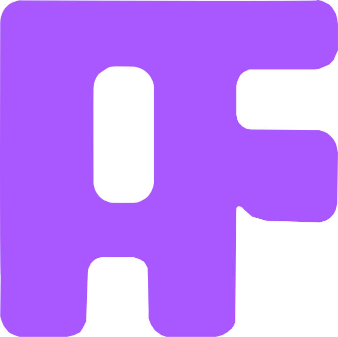

  

  
  
  
  

# ApplyWorkflow

Open-source pipeline to automate job applications: tailor CVs and emails with an LLM, compile PDFs with Typst, and optionally send via Gmail  from CLI or web UI.

## Features

- LLM-tailored CV keywords and emails (Groq or OpenAI)
- Typst CV → PDF per application
- Optional Gmail sending (safe dry-run by default)
- FastAPI backend + React web UI
- Docker image includes Typst for zero local setup

## Quick setup

Docker (recommended):
- cp .env.example .env && cp profile.json.example profile.json
- Optional for sending: add credentials.json (Google OAuth Desktop client) to project root
- docker compose up --build
- Open http://localhost:8000 (API docs at /docs)

Local (Typst required):
- python -m venv .venv && source .venv/bin/activate
- pip install -r requirements.txt
- cp .env.example .env && cp profile.json.example profile.json
- python run_api.py

## Usage

CLI:
- Dry run: python main.py
- Compile PDFs: python main.py --compile-pdf
- Send emails: python main.py --send --compile-pdf

Web UI:
- Open http://localhost:8000 and run from the browser.

## Config & required files

- .env  -> set LLM provider and key: GROQ_API_KEY or OPENAI_API_KEY
- profile.json -> your details used in the templates
- applications.xlsx -> your tracker (see applications.example.xlsx if present)
- credentials.json -> only if you plan to send via Gmail (token.json created on first auth)

Note: .env, credentials.json, token.json, profile.json, and applications.xlsx are git-ignored.

## Contributing

Contributions welcome! See CONTRIBUTING.md. Please open issues and PRs.

## License

MIT — see LICENSE.
